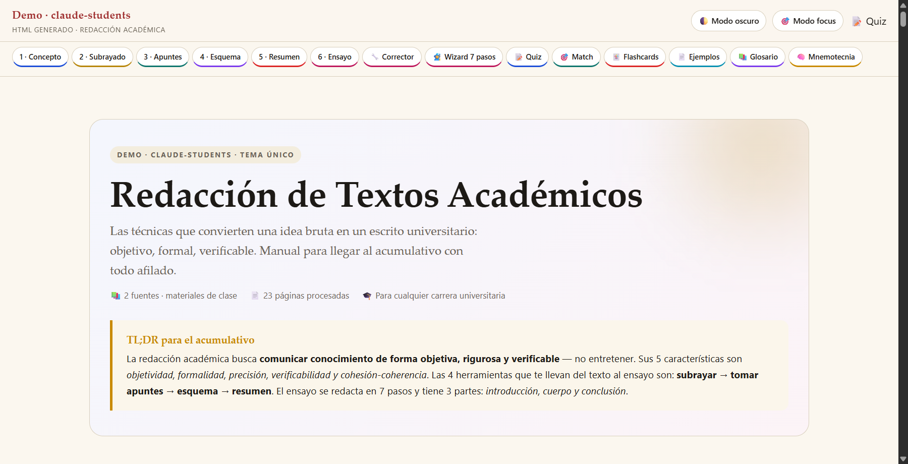
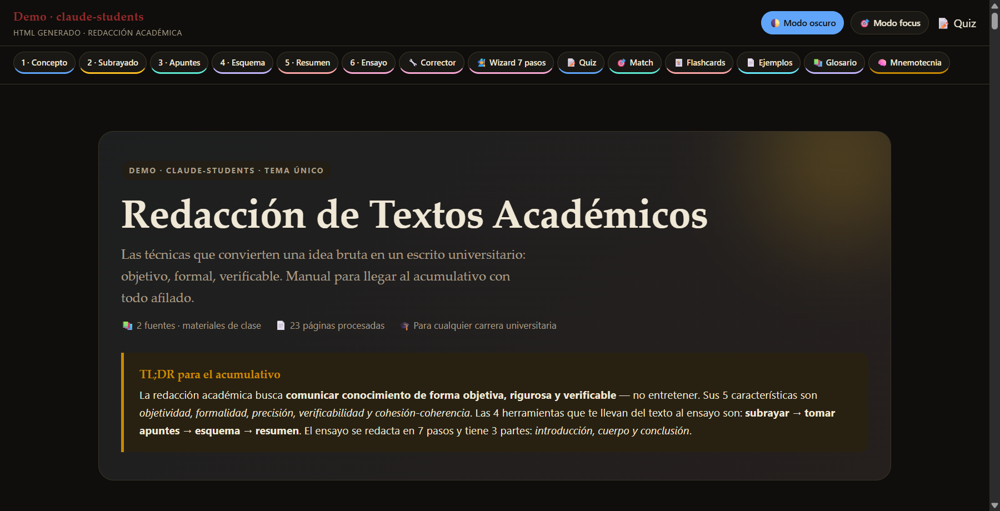
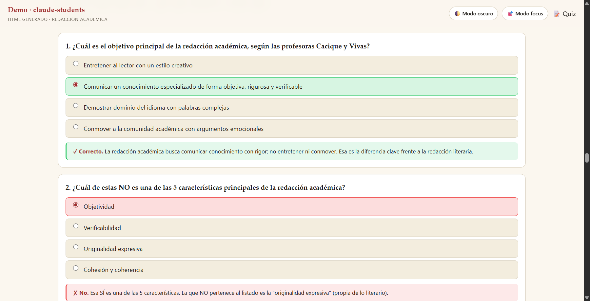
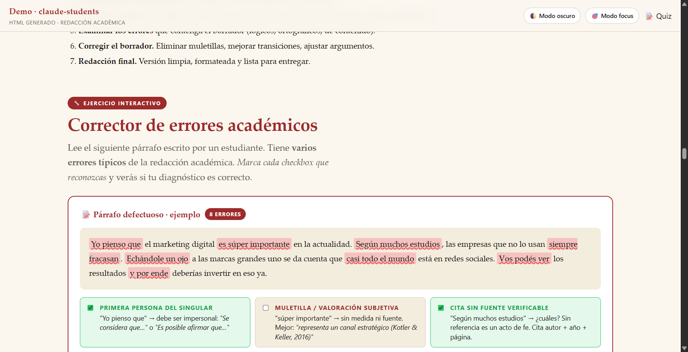
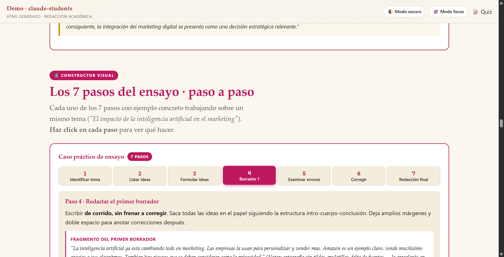
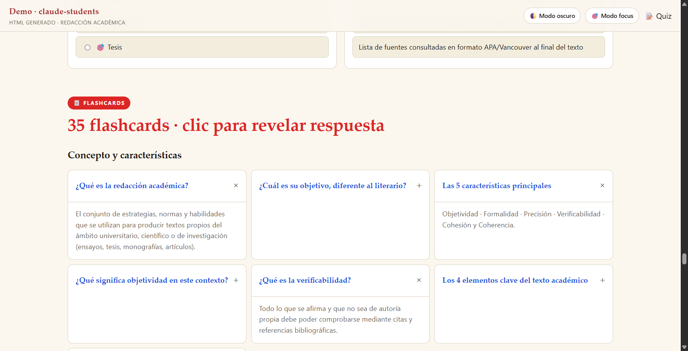
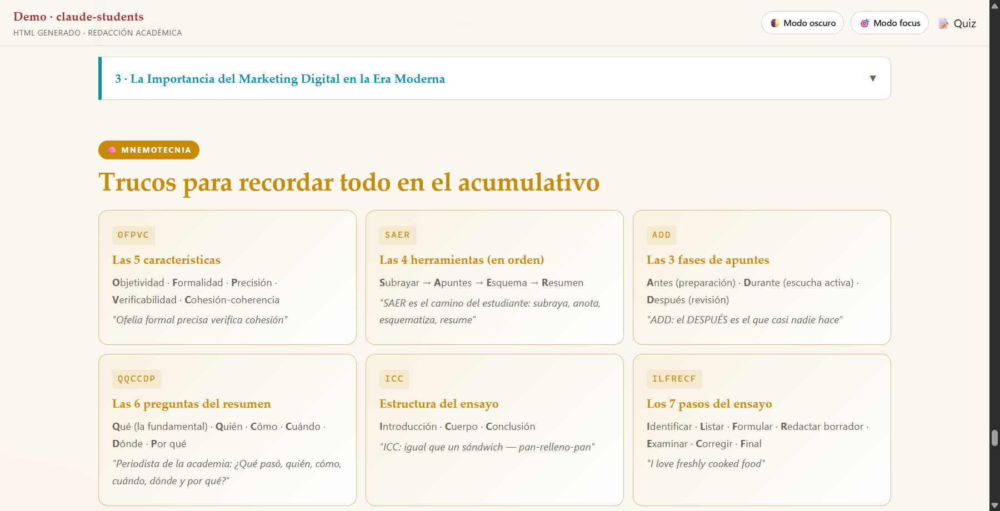

# claude-students

> Skill de Claude Code para estudiantes universitarios. Convierte el material crudo de un parcial — PDFs feos, DOCs viejos, capturas de WhatsApp, notas de voz — en un HTML de estudio interactivo + paquete completo de NotebookLM, en una sola conversación.

Pensado para estudiantes que reciben el material horas antes del examen y necesitan algo que rinda al máximo en el menor tiempo. No reemplaza el estudio — lo apalanca.



## Cómo se ve lo que genera

**Modo claro vs oscuro · ambos en un solo HTML, sin JavaScript:**

| Light mode | Dark mode |
|---|---|
|  |  |

**Quiz interactivo con feedback inmediato** — respuesta correcta en verde, incorrecta en rojo, ambas con explicación contextual:



**Corrector interactivo** — texto con errores subrayados que el estudiante identifica marcando checkboxes:



**Wizard de N pasos** — stepper CSS-only para procesos secuenciales (los 7 pasos de un ensayo, los 8 pasos de un proceso aduanero, etc.):



**Flashcards colapsables** agrupadas por tema · `<details>` puro, click para revelar respuesta:



**Mnemotecnia visual** estilo card dorada — acrónimos y frases para memorizar:



> Todos los componentes anteriores son **CSS puro** — sin JavaScript. Funcionan en cualquier navegador, son `@media print` friendly, y se ven igual en mobile y desktop.

Ver el HTML completo: [`examples/demo-redaccion-academica.html`](./examples/demo-redaccion-academica.html) (descárgalo y ábrelo localmente).

## Qué hay aquí

### `skills/claude-students`

El skill principal. Toma una carpeta con el material de un parcial y produce:

- **HTML autocontenido** (100-180 KB típicos) con quiz interactivo, flashcards, match game, glosario, mnemotecnias, modo claro/oscuro, modo focus, print-friendly — todo CSS puro, sin JavaScript.
- **Podcast en español** generado por NotebookLM (estilo deep-dive, ~30 min).
- **Infografía vertical** detallada.
- **Guía de estudio + Briefing Doc** en Markdown.
- **Mind map** en JSON.
- **Quiz + Flashcards** como backup.

Formatos de entrada soportados: PDF, DOC, DOCX, PPT, PPTX, capturas en PDF, audios `.ogg` de WhatsApp.

## Cómo se ve el output

Cada parcial procesado genera una estructura como:

```
<carpeta-parcial>/
├── <archivos originales, sin tocar>
└── Claude/
    ├── <MATERIA>.html              ← entregable principal
    ├── _artefactos/
    │   ├── NotebookLM_Podcast_ES.mp3
    │   ├── NotebookLM_Infographic.png
    │   ├── NotebookLM_GuiaEstudio.md
    │   ├── NotebookLM_BriefingDoc.md
    │   ├── NotebookLM_MindMap.json
    │   ├── NotebookLM_Quiz.md
    │   └── NotebookLM_Flashcards.md
    └── _transcripcion/             ← solo si había audios
        └── <audio>.transcripcion.md
```

## Cómo se usa

Una vez instalado el skill, en Claude Code basta con frases como:

- *"tengo parcial de derecho mañana, te paso la carpeta @\"<ruta>\""*
- *"haz un material de estudio con estos archivos"*
- *"convierte esta carpeta en HTML estudiable + audio"*

El skill se dispara solo. No requiere recordar comandos.

## Dependencias

Este skill requiere otros componentes para funcionar al 100%:

### Obligatorias

| Dependencia | Para qué | Cómo obtenerlo |
|---|---|---|
| **[gemini-transcribe](https://github.com/josuebustosn/gemini-transcribe)** | Transcribir audios `.ogg` de WhatsApp con Gemini | Clonar como skill `transcribir` |
| **NotebookLM MCP** (`notebooklm-mcp-cli`) | Generar podcast, infografía, reports, mind map, quiz, flashcards | [github.com/notebooklm-mcp/cli](https://github.com/notebooklm-mcp/cli) — requiere cuenta Google con acceso a NotebookLM |
| **LibreOffice** | Convertir `.doc/.docx/.ppt/.pptx` a PDF | [libreoffice.org](https://www.libreoffice.org/) |
| **Python 3.10+** con **PyMuPDF** (`pip install pymupdf`) | Renderizar PDFs a PNG para lectura multimodal | python.org |

### Opcionales

- **Gemini API key** en `GEMINI_API_KEY` (para transcribir audios) — `aistudio.google.com`

## Instalación

Ver [INSTALL.md](./INSTALL.md) para instrucciones paso a paso.

Resumen rápido:

```bash
# 1. Clonar este repo y la dependencia de transcripción
git clone https://github.com/josuebustosn/claude-students ~/.claude/skills-source/claude-students
git clone https://github.com/josuebustosn/gemini-transcribe ~/.claude/skills-source/gemini-transcribe

# 2. Symlink (o copiar) los skills a la carpeta de skills de Claude Code
ln -s ~/.claude/skills-source/claude-students/skills/claude-students ~/.claude/skills/claude-students
ln -s ~/.claude/skills-source/gemini-transcribe ~/.claude/skills/transcribir

# 3. Instalar PyMuPDF y configurar GEMINI_API_KEY
pip install pymupdf
export GEMINI_API_KEY="<tu_api_key>"

# 4. Instalar NotebookLM MCP (ver INSTALL.md)
```

## ¿Por qué este skill existe?

Procesar un parcial de cero suele requerir ~50 turnos consecutivos con Claude: descubrir el flujo, tropezar con los mismos bugs (auth de NotebookLM expirada, archivos con paréntesis, encoding roto en transcripciones, etc.), reescribir el HTML desde el patrón cero. Este skill encapsula **8 fases validadas** y **12 gotchas documentados** para que el próximo parcial tome 10-15 turnos en vez de 50.

## ¿Qué hace especial al HTML que produce?

El HTML que genera el skill aplica un patrón validado a lo largo de varias entregas:

- **Sin JavaScript.** Todo CSS moderno (`:has()`, `:checked`, `<details>`, `color-mix()`). Funciona en cualquier navegador mobile sin glitches.
- **Modo oscuro + modo focus** con un solo checkbox CSS.
- **Quiz con feedback inmediato** que aprueba/rechaza la respuesta y explica el error.
- **Match game** para emparejar conceptos.
- **Flashcards colapsables** `<details>` agrupadas por tema.
- **Explorador chip + ficha** para taxonomías cerradas (artículos legales, INCOTERMS, fórmulas).
- **Wizard / stepper** para procesos de N pasos.
- **Corrector interactivo** (texto con errores subrayados que el lector identifica).
- **Mnemotecnias** en cards estilo dorado.
- **Glosario** completo en `<details>`.
- **Print-friendly:** todos los componentes colapsables se expanden al imprimir.
- **Color-coded por tema** con custom properties — visualmente legible.

El patrón completo está documentado en `skills/claude-students/references/html-pattern.md`.

## Estructura del repo

```
claude-students/
├── README.md
├── LICENSE                     # MIT
├── INSTALL.md                  # Paso a paso por OS
└── skills/
    └── parcial-estudio/
        ├── SKILL.md            # Workflow completo en 8 fases
        ├── references/
        │   ├── html-pattern.md         # Patrón del HTML SOTA
        │   ├── notebooklm-workflow.md  # Prompts y configuración
        │   └── bugs-conocidos.md       # 12 gotchas con su fix
        └── scripts/
            ├── convert_to_pdf.ps1      # LibreOffice wrapper (Windows)
            ├── convert_to_pdf.sh       # LibreOffice wrapper (Mac/Linux)
            ├── render_pdfs.py          # PyMuPDF a PNG
            └── setup_carpeta.ps1       # Crear estructura
```

## Limitaciones conocidas

- **Idioma:** optimizado para parciales en **español**. El HTML, los prompts a NotebookLM y los componentes UI están en español. Adaptarlo a otros idiomas requiere editar el `SKILL.md` y los focus_prompts.
- **NotebookLM access:** requiere cuenta Google con NotebookLM habilitado. La autenticación expira frecuentemente (~80% de las sesiones) — el skill maneja la recuperación automática vía `nlm login`.
- **Calidad de inputs:** el skill rinde según la calidad del material. PDFs OCR malos producen HTML débil. Audios borrosos producen transcripciones imprecisas.
- **Mind map en inglés:** NotebookLM frecuentemente devuelve el mind map en inglés aunque se pida en español. Es un bug aguas arriba; el JSON resultante igual es útil como estructura.

## Inspiración

- [`gemini-transcribe`](https://github.com/josuebustosn/gemini-transcribe) — la pieza de transcripción que este skill orquesta.
- [`ucat-plus`](https://github.com/josuebustosn/ucat-plus) — proyecto hermano: notas universitarias rediseñadas.
- [`deep-research`](https://github.com/josuebustosn/deep-research) — mismo enfoque de "skill que orquesta múltiples motores en paralelo".

## Contribuir

PRs bienvenidos — especialmente:

- Adaptaciones a otros idiomas
- Componentes nuevos para el patrón del HTML (otra forma interactiva CSS-only)
- Scripts equivalentes a `convert_to_pdf.ps1` para macOS / Linux
- Mejoras al manejo de NotebookLM cuando devuelve contenido en idioma incorrecto

## Licencia

MIT — ver [LICENSE](./LICENSE).

---

Hecho por [Josue Bustos](https://github.com/josuebustosn). Si te sirve, una ⭐ se agradece.
